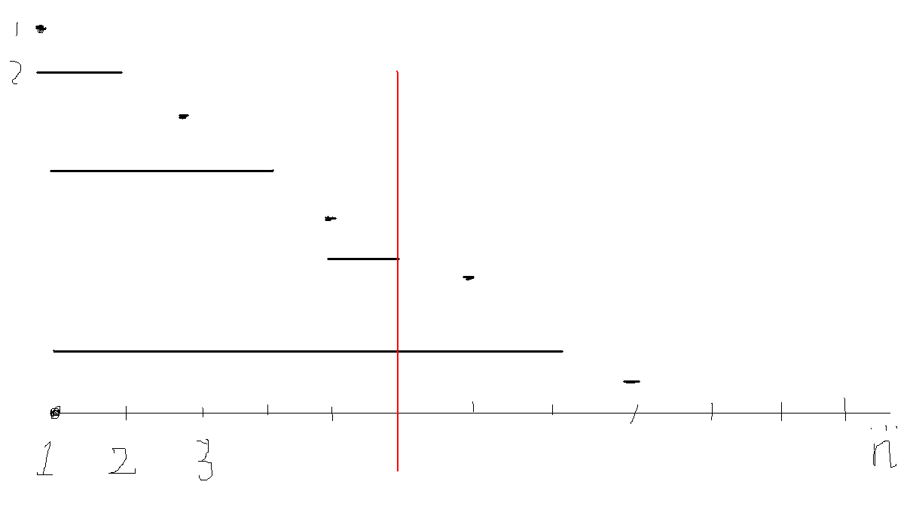

## 一, 工作原理

> 树状数组是一种支持**单点修改**和**区间查询**的数据结构。普通树状数组维护的信息及运算要满足**结合律**且**可差分**，如加法（和）、乘法（积）、异或等。 ——OI WIKI


数组中下标为x的元素管辖区间为```[x-lowbit(x)+1,x]```

## 二，建树

```c++
void build()
{
    for (int i = 1; i <= n; i++)
    {
        tree[i] = max(tree[i], a[i]);
        int j = i + lowbit(i);
        if (j <= n) tree[j] = max(tree[j], tree[i]);
    }
}
```

## 三，单点修改



```c++
void add(int x, int c)
{
    tree[x] = a[x] = c;
    for (int i = 1; i < lowbit(x); i <<= 1) tree[x] = max(tree[x], tree[x - i]);

    for (int i = x; i + lowbit(i) <= n; i += lowbit(i))
    {
        int j = lowbit(i);
        tree[i + j] = max(tree[i + j], tree[i]);
    }
}
```

## 四，区间查询

```c++
int query(int l, int r)
{
    int res = -INF;
    while (l <= r)
    {
        for (; l <= r && r - lowbit(r) + 1 >= l; r -= lowbit(r))
        {
            res = max(tree[r], res);
        }

        if (l > r) break;
        res = max(a[r], res);
        r--;
    }
    return res;
}
```
